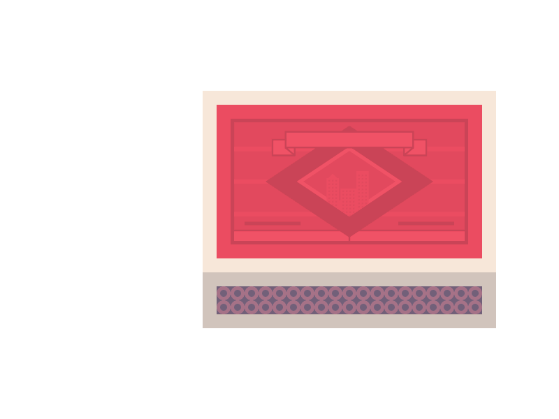

[
](https://coveralls.io/r/studio-b12/doxie-dummy-data)
 [
](https://travis-ci.org/studio-b12/doxie-dummy-data)
 [
](https://david-dm.org/studio-b12/doxie-dummy-data)
 [
](https://nodejs.org/api/documentation.html#documentation_stability_index)
 [
](https://github.com/airbnb/javascript)


doxie-dummy-data
================

**A [tiny][] utility for testing *[doxie][]* plugins.**

[tiny]:   ./module/index.js
[doxie]:  http://npm.im/doxie


<p align="center"><a
  title="Graphic by the great Justin Mezzell"
  href="http://justinmezzell.tumblr.com/post/88665824413"
  >
  <br/>
  <br/>
  
  <br/>
  <br/>
</a></p>


Installation
------------

```sh
$ npm install doxie-dummy-data
```


Usage
-----

<h3><pre>
dummyData(docs)
  → doxieData
</pre></h3>

**Parameters:**

* **`docs`**  
  <sup>type: Array</sup>  
  An array of docs – for example, coming from *dox*.

**Return value:**  

* **`doxieData`**  
  <sup>type: Object</sup>  
  A doxie-compatible object. It can be piped into a plugin or returned by a plugin.


License
-------

[MIT][] © [Studio B12 GmbH][]

[MIT]:              ./License.md
[Studio B12 GmbH]:  http://studio-b12.de
